# 인간화 나노바디 플랫폼 구축

## 1. 개요

본 연구는 종양 미세환경(Tumor Microenvironment, TME) 표적 다중 항체 생산을 위한 **인간화 나노바디 플랫폼**을 구축하는 것을 목표로 한다. 나노바디(VHH)는 낙타과 유래 단일 도메인 항체로, 기존 항체(IgG) 대비 소형(~15 kDa), 높은 조직 침투력, 우수한 안정성 등의 장점을 가지나, 임상 적용 시 면역원성(immunogenicity) 문제가 발생할 수 있다. 이를 해결하기 위해 나노바디의 framework(FR) 영역을 인간 germline 서열로 치환하는 인간화(humanization) 전략을 수립하고, 구조적 안정성을 유지하면서 인간 유사성을 극대화하는 최적 서열을 설계하였다.

나아가, 인간화된 FR scaffold 위에 다양한 CDR 서열을 도입하여 신규 표적에 대한 나노바디 라이브러리를 구축하고, yeast display를 통해 종양 미세환경 내 다양한 표적(CAF marker, immune checkpoint 등)에 결합하는 다중 항체를 선별하는 플랫폼을 구현한다.

---

## 2. 모델 나노바디 선정 및 실험 검증

### 2.1 Anti-FAP 나노바디

Fibroblast Activation Protein(FAP)을 표적으로 하는 나노바디를 모델 항체로 선정하였다 (CN106928368B, 125 aa).

```
QVQLQESGGGSVQAGGSLRLSCAASGYTVRSSYMGWFRQVPGKQREAVAIITSGGTTYYADSVKGRFTISRDNAKNTLYLQMNSLKPEDTAMYYCAGRTGFIGGIWFRDRDYDYWGQGTQVTVSS
```

이 나노바디는 실험실에서 대장균 발현 시스템을 통해 안정적으로 생산되며, 정제 후에도 높은 수율과 안정성을 보임을 확인하였다. 또한 human FAP과 mouse FAP에 대해 **cross-reactivity**를 가져, 전임상 동물 모델에서의 약효 평가가 가능한 장점이 있다.

### 2.2 인간화 대상 germline 선정

IMGT DomainGapAlign (https://www.imgt.org/3Dstructure-DB/cgi/DomainGapAlign.cgi) 분석을 통해 anti-FAP 나노바디와 가장 높은 서열 유사성을 보이는 인간 germline으로 **IGHV3-66**을 동정하였다. VH3 family는 인간 VH germline 중 나노바디(VHH)와 구조적으로 가장 유사한 것으로 알려져 있어 CDR grafting에 적합하다.

IGHV3-66 germline과 비교하여 FR 영역에서 13개 잔기가 상이하였으며, 이를 인간화 후보 mutation으로 선정하였다:

> Q1E, Q5V, S12L, A15P, G40S, V45A, A54S, I55V, A83S, K95R, P96A, M101V, Q123L

**VHH hallmark 잔기**(IMGT position 42, 49, 50, 52)는 나노바디의 용해성과 안정성에 핵심적인 역할을 하므로 인간화 대상에서 제외하였다. 이 위치의 VHH 고유 잔기(F42, Q49, R50, A52)를 보존함으로써 나노바디 고유의 구조적 특성을 유지하였다.

---

## 3. 구조 기반 안정성 평가

### 3.1 3차원 구조 예측

인간화 mutation의 구조적 영향을 평가하기 위해 먼저 나노바디의 3차원 구조를 예측하였다. AlphaFold3를 이용하여 anti-FAP 나노바디의 구조를 예측한 결과, 높은 신뢰도(pTM = 0.88)의 모델을 얻었으며, disulfide bond(Cys22-Cys95) 형성, steric clash 부재, disordered region 부재를 확인하여 하류 분석에 적합한 구조임을 검증하였다.

잔기별 pLDDT(predicted Local Distance Difference Test) 분석 결과, 전체 평균 92.4로 매우 높은 신뢰도를 보였다. FR 영역은 대부분 95 이상의 very high confidence를 보였으며, CDR3 loop 일부만 70-80 수준으로 loop의 내재적 유연성에 기인한 자연스러운 현상이다. PAE(Predicted Aligned Error) 분석에서도 잔기 간 상대 위치에 대해 전반적으로 낮은 오차를 보여, 예측 구조의 신뢰성을 확인하였다.

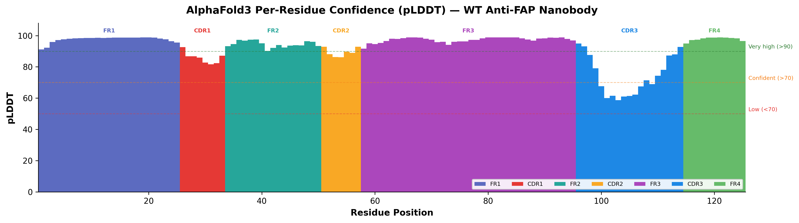

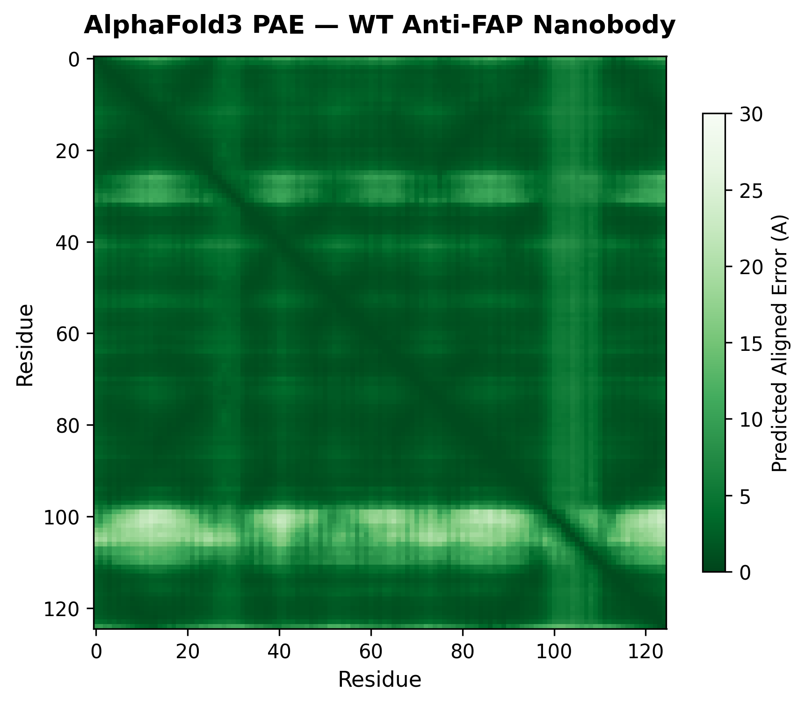

### 3.2 Rosetta Cartesian ddG 계산

예측된 구조를 기반으로 13개 인간화 후보 mutation 각각에 대해 **Rosetta Cartesian ddG**를 계산하여 열역학적 안정성 변화를 정량적으로 평가하였다.

Cartesian ddG는 mutation 도입 전후의 Rosetta 에너지 차이(ddG = E_mutant - E_WT)를 Cartesian 좌표 공간에서 계산하는 방법으로, torsion 공간 기반 방법 대비 높은 정확도를 보인다 (Kellogg et al., 2011; Park et al., 2016). ref2015_cart score function을 사용하였으며, 각 mutation당 5회 반복 계산을 수행하여 통계적 신뢰성을 확보하였다. 주요 파라미터는 다음과 같다:

- Score function: ref2015_cart (Cartesian 공간 최적화)
- Iterations: 5 (독립 반복)
- Backbone flexibility: ±1 residue (bbnbrs 1)
- Sidechain repacking radius: 9 A (fa_max_dis 9.0)

ddG 값에 따라 mutation을 다음과 같이 분류하였다:

| 분류 | ddG 범위 (REU) | 해석 |
|------|:---:|------|
| Strongly destabilizing | > +2.0 | 발현/안정성 고위험 |
| Moderately destabilizing | +1.0 ~ +2.0 | 중위험, 복귀 고려 |
| Neutral | -0.5 ~ +0.5 | 영향 미미 |
| Stabilizing | < -0.5 | 안정성에 유리 |

### 3.3 Set1 결과: 13개 개별 mutation 평가

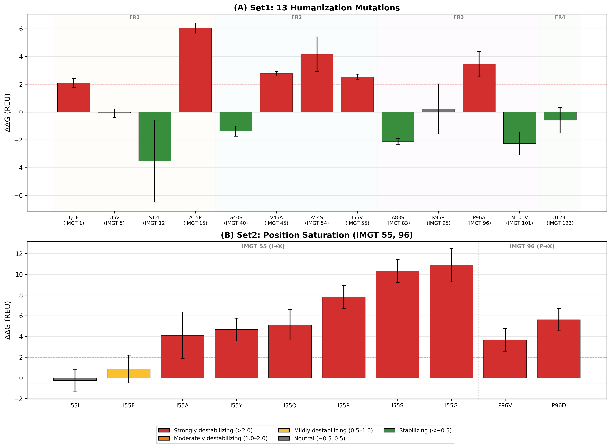

13개 mutation의 ddG 분석 결과, 7개는 neutral 또는 stabilizing으로 안전하게 도입 가능하였으나, 6개는 strongly destabilizing(ddG > +2.0 REU)으로 판정되었다:

| Mutation | IMGT | ddG (REU) | 분류 |
|----------|:---:|:---:|------|
| Q5V | 5 | -0.09 | Neutral |
| S12L | 12 | -3.54 | Stabilizing |
| G40S | 40 | -1.38 | Stabilizing |
| A83S | 83 | -2.13 | Stabilizing |
| K95R | 95 | +0.23 | Neutral |
| M101V | 101 | -2.27 | Stabilizing |
| Q123L | 123 | -0.59 | Stabilizing |
| **Q1E** | **1** | **+2.09** | **Destabilizing** |
| **A15P** | **15** | **+6.04** | **Destabilizing** |
| **V45A** | **45** | **+2.76** | **Destabilizing** |
| **A54S** | **54** | **+4.16** | **Destabilizing** |
| **I55V** | **55** | **+2.52** | **Destabilizing** |
| **P96A** | **96** | **+3.44** | **Destabilizing** |

---

## 4. Destabilizing mutation에 대한 심층 분석

Destabilizing으로 판정된 6개 position에 대해 두 가지 추가 분석을 수행하였다: (1) human VH3 germline에서의 아미노산 비율 분석, (2) 대안 아미노산 탐색.

### 4.1 VH3 Germline 아미노산 비율 분석

OGRDB(Open Germline Receptor Database)에서 human IGHV3 family의 93개 allele(67개 unique sequence)를 수집하고, ANARCI를 이용하여 IMGT numbering을 적용한 뒤, 각 position에서의 아미노산 출현 비율을 계산하였다.

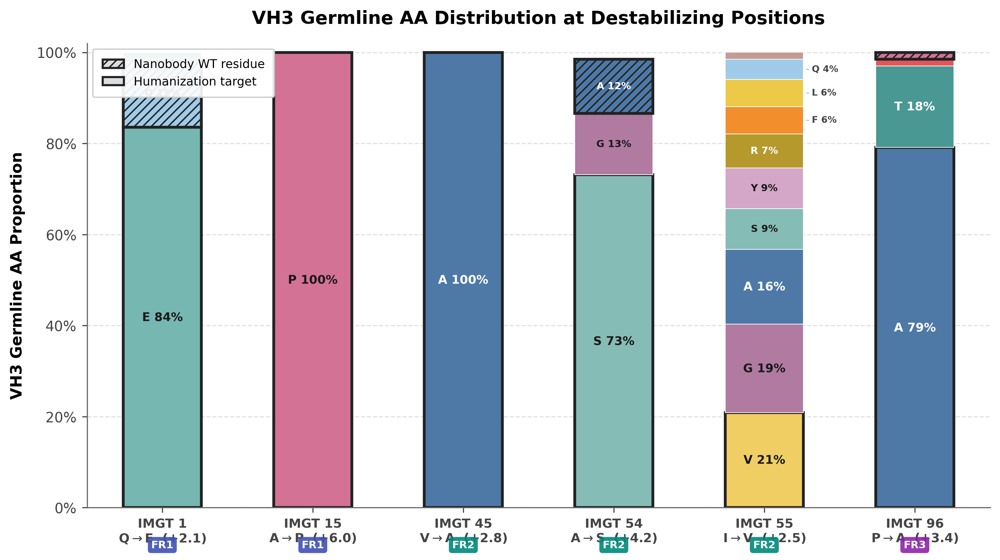

이 분석을 통해 다음과 같은 판단이 가능하였다:

**IMGT 1 (Q→E):** 인간 VH3에서 E가 83.6%로 압도적이나, 원래 나노바디 잔기인 Q도 14.9%로 존재한다. ddG가 +2.09 REU로 destabilizing이고, Q가 VH3에서도 소수이나마 존재하므로 **변경하지 않는 것**으로 결정하였다.

**IMGT 54 (A→S):** VH3에서 S가 73.1%이나, 원래 잔기 A도 11.9%로 존재한다. ddG가 +4.16 REU로 strongly destabilizing이므로 **변경하지 않는 것**으로 결정하였다.

**IMGT 15 (A→P), IMGT 45 (V→A):** 각각 P 100%, A 100%로 인간 germline에서 완전히 보존된 잔기이나, ddG가 각각 +6.04, +2.76 REU로 구조적 불안정화가 심하여 **변경하지 않는 것**으로 결정하였다.

**IMGT 55 (I→V) 및 IMGT 96 (P→A):** 이 두 position은 대안 아미노산 탐색 대상으로 선정하였다.

### 4.2 Set2: 대안 아미노산 탐색 (Position Saturation)

IMGT 55와 96에 대해 VH3 germline에서 출현하는 다양한 아미노산으로의 치환을 시도하였다.

**IMGT 55:** VH3에서 V(20.9%), G(19.4%), A(16.4%) 등 10종의 아미노산이 고르게 분포하여, 다양한 대안 탐색의 가치가 있었다. I55→G, A, S, Y, R, F, L, Q 총 8개 변이에 대해 ddG를 계산한 결과, **I55L만이 유일하게 음의 ddG(-0.25 REU)**를 보여 안정성을 유지하면서 인간화가 가능하였다.

**IMGT 96:** A(79.1%), T(17.9%)가 주를 이루어 P96V, P96D를 추가 테스트하였으나, 모두 destabilizing(P96V: +3.68, P96D: +5.62 REU)으로 **변경하지 않는 것**으로 최종 결정하였다.

---

## 5. 최종 인간화 서열 결정

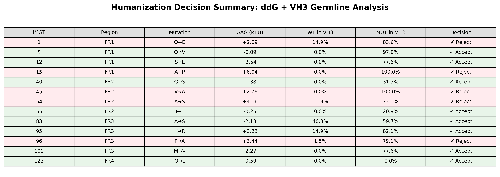

Rosetta ddG 안정성 평가와 VH3 germline 아미노산 비율 분석을 종합하여, 13개 후보 중 **8개 mutation을 최종 채택**하였다:

| IMGT | Mutation | ddG (REU) | 결정 | 근거 |
|:---:|---|:---:|:---:|------|
| 5 | Q→V | -0.09 | Accept | Neutral, VH3 97.0% |
| 12 | S→L | -3.54 | Accept | Stabilizing |
| 40 | G→S | -1.38 | Accept | Stabilizing |
| 55 | I→**L** | -0.25 | Accept | Set2에서 유일한 음의 ddG |
| 83 | A→S | -2.13 | Accept | Stabilizing |
| 95 | K→R | +0.23 | Accept | Neutral, conservative |
| 101 | M→V | -2.27 | Accept | Stabilizing |
| 123 | Q→L | -0.59 | Accept | Stabilizing |

5개 mutation은 구조적 불안정화 위험으로 reject하였다: Q1E(+2.09), A15P(+6.04), V45A(+2.76), A54S(+4.16), P96A(+3.44).

최종 인간화 서열:

```
WT:        QVQLQESGGGSVQAGGSLRLSCAASGYTVRSSYMGWFRQVPGKQREAVAIITSGGTTYYADSVKGRFTISRDNAKNTLYLQMNSLKPEDTAMYYCAGRTGFIGGIWFRDRDYDYWGQGTQVTVSS
                *     *                       *              *                       *           *     *                           *
Humanized: QVQLVESGGGLVQAGGSLRLSCAASGYTVRSSYMSWFRQVPGKQREAVALITSGGTTYYADSVKGRFTISRDNSKNTLYLQMNSLRPEDTAVYYCAGRTGFIGGIWFRDRDYDYWGQGTLVTVSS
```

### 5.1 인간화 효과 정량 평가

인간화 전후의 humanness를 두 가지 지표로 정량화하였다:

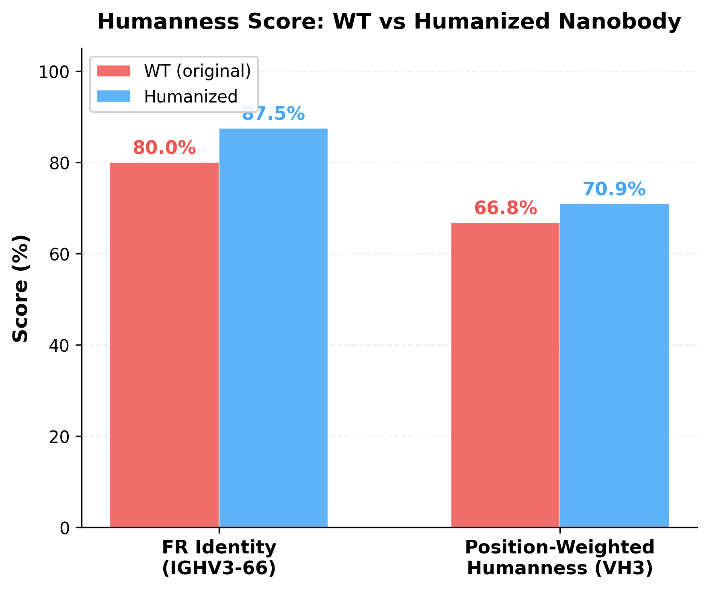

| 지표 | WT | Humanized | 변화 |
|------|:---:|:---:|:---:|
| FR Identity (IGHV3-66) | 80.0% | **87.5%** | **+7.5%** |
| Position-Weighted Humanness (VH3 family) | 66.8% | **70.9%** | **+4.1%** |

FR Identity는 target germline인 IGHV3-66과 FR 잔기의 일치 비율을, Position-Weighted Humanness는 VH3 family 67개 unique germline 전체에서 각 position의 아미노산 출현 비율 평균을 나타낸다. 인간화를 통해 두 지표 모두 유의미하게 향상되었으며, 동시에 Rosetta ddG 분석을 통해 구조적 안정성이 보존 또는 개선됨을 확인하였다.

또한 인간화 서열에 대해 AlphaFold3 구조 예측을 수행한 결과, 5개 모델 모두 WT와 동일한 pTM(0.88)을 보여 인간화에 의한 구조 예측 신뢰도 저하가 없음을 확인하였다.

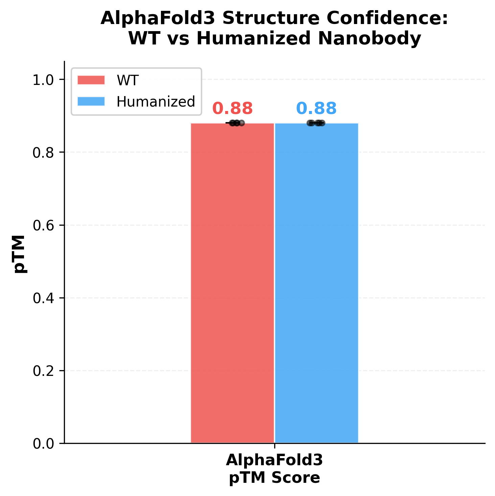

WT와 Humanized 구조 간 RMSD를 계산한 결과, all-atom 0.169 A, backbone 0.155 A, CA 0.158 A로 모두 0.5 A 이하의 미미한 차이를 보여, 8개 FR mutation이 나노바디의 전체 3차원 구조에 실질적인 영향을 미치지 않음을 정량적으로 확인하였다.

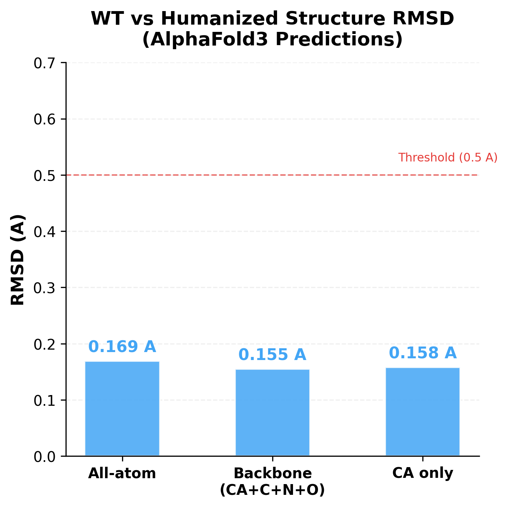

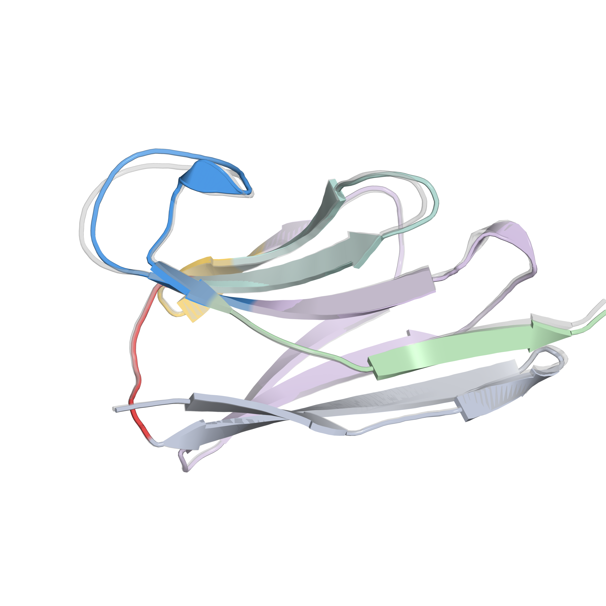

### 5.2 Multi-mutant 안정성 검증

개별 mutation의 ddG는 단일 치환에 대한 평가이므로, 8개 mutation을 동시에 도입했을 때의 복합 효과를 검증하기 위해 **multi-mutant Cartesian ddG** 계산을 수행하였다.

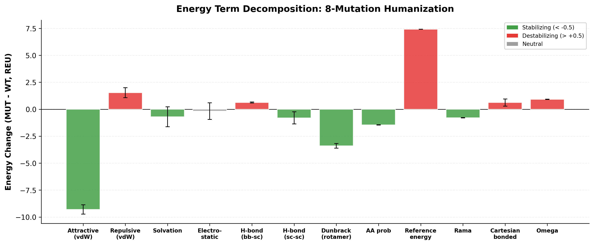

8개 mutation 동시 적용 시 ddG = **-7.710 ± 0.198 REU**로, 인간화 서열이 WT 대비 열역학적으로 더 안정함을 확인하였다. 개별 ddG의 단순 합산(-10.02 REU)과 비교하면 epistatic effect는 **+2.31 REU**로, mutation 간 약한 상호작용이 존재하나 전체적으로 여전히 강하게 stabilizing하였다.

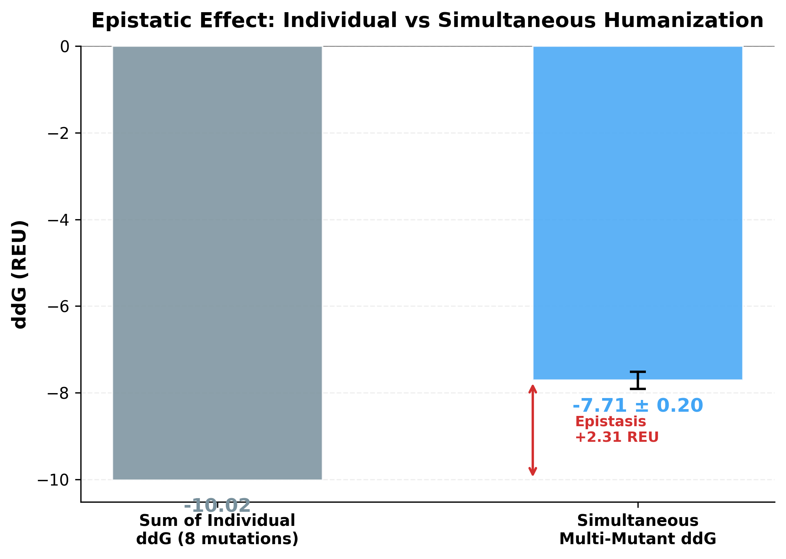

에너지 항 분해 분석(energy decomposition)에서 fa_atr(van der Waals attractive)이 -9.30 REU로 가장 큰 안정화 기여를 보였으며, fa_dun(rotamer energy, -3.40 REU)과 p_aa_pp(Ramachandran probability, -1.46 REU)도 안정화에 기여하였다.

추가로 **FastRelax** 프로토콜을 이용한 전체 에너지 비교에서도 Humanized(-447.89 ± 1.49 REU, n=12)가 WT(-438.05 ± 3.34 REU, n=5) 대비 **-9.84 REU** 낮은 총 에너지를 보여, 인간화에 의한 전체 구조 안정성 향상을 독립적으로 확인하였다. Humanized의 표준편차가 WT 대비 작은 것 또한 인간화 서열의 에너지 landscape가 더 좁고 안정적임을 시사한다.

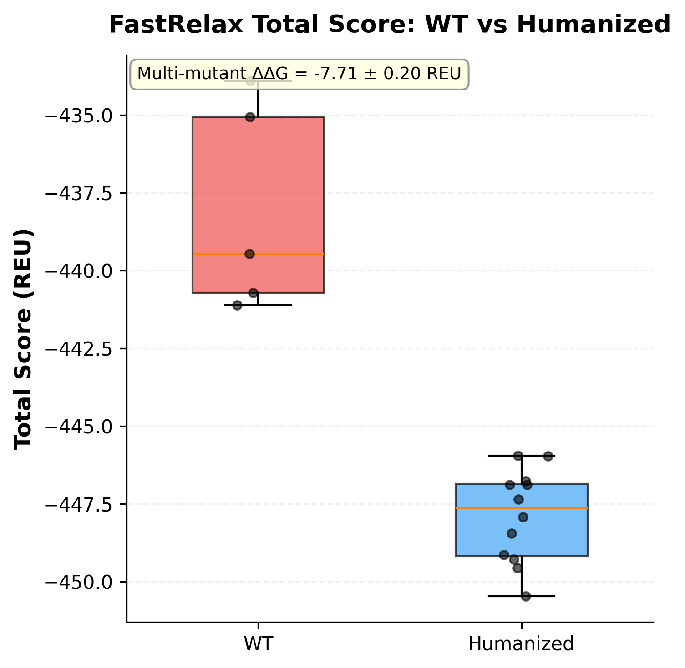

---

## 6. CDR 라이브러리 설계를 위한 구조 데이터베이스 분석

인간화된 FR scaffold 위에 다양한 CDR을 도입하여 나노바디 라이브러리를 구축하기 위해, **SAbDab-nano 데이터베이스**에 등록된 약 1,900개의 나노바디 구조를 체계적으로 분석하였다. 이 분석의 목적은 자연계 나노바디에서 관찰되는 CDR의 길이 분포와 position별 아미노산 선호도를 파악하여, 구조적으로 유효한 CDR 라이브러리의 설계 파라미터를 결정하는 것이다.

### 6.1 CDR 길이 분포

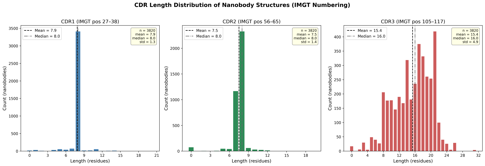

IMGT numbering 기준으로 CDR1(position 27-38), CDR2(position 56-65), CDR3(position 105-117, insertion code 포함)의 길이 분포를 분석하였다.

- **CDR1:** 대부분 **8 residues**로 고정 (IMGT position 27-38 중 gap 없는 경우)
- **CDR2:** 대부분 **8 residues**로 고정
- **CDR3:** **14, 17, 21 residues**에서 local maxima가 관찰됨

CDR3의 길이 다양성이 나노바디의 항원 결합 특이성을 결정하는 핵심 요소이므로, 라이브러리에서 CDR3 길이를 14, 17, 21의 **3가지 variant**로 설계하기로 결정하였다. CDR1과 CDR2는 각각 8 aa로 고정하였다.

### 6.2 Position별 아미노산 선호도

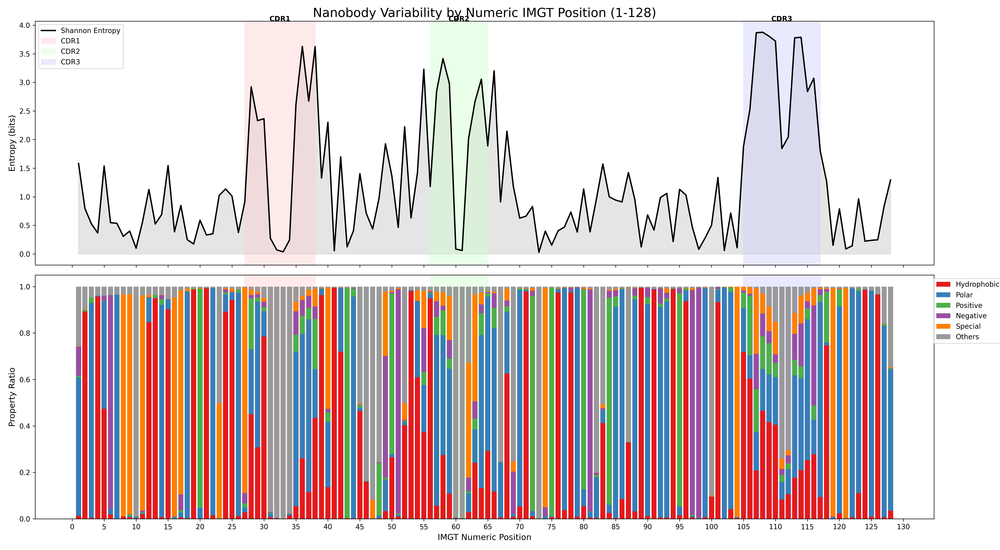

각 IMGT position에서의 Shannon entropy를 계산하여 서열 다양성을 정량화하였다. CDR 영역은 FR 영역 대비 현저히 높은 entropy를 보여, CDR이 항원 결합 다양성의 주요 원천임을 확인하였다. CDR 내 각 position의 아미노산 출현 비율을 분석하여, trimer phosphoramidite primer 설계 시 각 position에서의 아미노산 조성 비율을 결정하는 데 활용하였다.

### 6.3 라이브러리 구축 전략

상기 분석 결과를 종합하여, 인간화 FR scaffold 위에 trimer phosphoramidite 방식으로 CDR 라이브러리를 합성하기로 결정하였다. Trimer phosphoramidite는 codon 단위로 합성이 가능하여 stop codon을 배제하고, 각 position에서 원하는 아미노산 비율로 정밀하게 조절할 수 있는 장점이 있다.

---

## 7. 결론

본 연구를 통해 anti-FAP 나노바디의 인간화 최적 서열을 결정하고, CDR 라이브러리 설계 파라미터를 확립하였다. 인간화 과정에서 computational 접근(AlphaFold3 구조 예측, Rosetta ddG 안정성 평가, VH3 germline 비율 분석)을 체계적으로 활용하여 구조적 안정성과 인간 유사성을 동시에 최적화하였으며, SAbDab-nano 데이터베이스 분석을 통해 자연계 나노바디의 CDR 특성을 반영한 라이브러리 설계 전략을 수립하였다.

이 인간화 나노바디 플랫폼은 anti-FAP 나노바디에 국한되지 않고, 향후 종양 미세환경 내 다양한 표적에 대한 나노바디 개발에 범용적으로 활용 가능한 인프라로서의 가치를 가진다.
